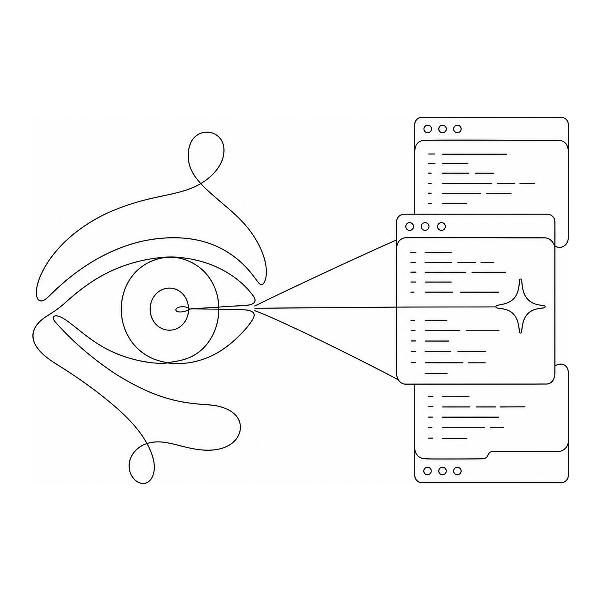

<p align="center">
  
</p>

# gaze-pane

Auto-select the iTerm2 pane you're looking at. Webcam tracks your eyes, a
ridge-regularized affine model maps gaze to screen position, and the iTerm2
Python API focuses whichever pane the gaze lands in.

## Requirements

- macOS (tested on Apple Silicon — M4 Max)
- Python 3.10, 3.11, or 3.12 (MediaPipe wheels don't ship for 3.13+ yet)
- iTerm2
- A working webcam

## Install

```bash
git clone https://github.com/noahjohnson0/gaze-pane.git
cd gaze-pane
./setup.sh
```

`setup.sh` creates a `.venv`, installs requirements, runs `pip install -e .`
so the `gaze-pane` console script lands on the venv's PATH, and downloads the
~4 MB MediaPipe face-landmarker model.

After that, the entrypoint lives at `./.venv/bin/gaze-pane`. Either activate
the venv (`source .venv/bin/activate`) or call it by full path. Symlink to
`~/bin/gaze-pane` if you want it bare.

## iTerm2 setup

gaze-pane talks to iTerm2 over its built-in WebSocket Python API. Enable it
once:

1. Open iTerm2's Settings (Cmd+,) → **General** → **Magic**.
2. Check **Enable Python API**.
3. Set the dropdown below it to **Allow all apps**. The "Require
   Automation permission" option will reject the script with HTTP 401
   unless you have already granted the Python binary Automation permission
   for iTerm2 — and macOS only surfaces that permission prompt after a
   successful connection, so it's a chicken-and-egg. "Allow all apps" is
   simpler.

The first time you run `gaze-pane run`, iTerm2 will pop a dialog asking to
authorize the script. Click **Always allow**.

If you ever see `HTTP 401` or `could not connect to iTerm2's Python API` in
the runner output, the API toggle is off or the dropdown is on
Automation-permission mode.

## Camera setup

On first calibration, macOS will prompt for Camera access for whichever
terminal you launch gaze-pane from (iTerm2 itself, Terminal, your IDE's
integrated terminal). Click Allow. **Note:** macOS can't grant the permission
mid-process — if the prompt comes up after the run has already failed, retry
the command.

**Continuity Camera gotcha:** a nearby iPhone registered as a Continuity
Camera usually shows up as camera **0** and the built-in MacBook camera as
camera **1**. Pass `--camera 1` for the built-in. To probe what's available:

```bash
.venv/bin/python scripts/list_cameras.py
```

That prints per-index resolution, mean brightness, and how many of 10 sample
frames had a face detected.

## Calibrate

```bash
gaze-pane calibrate --camera 1                     # default 4x4 grid (16 points)
gaze-pane calibrate --camera 1 --grid 5            # 5x5 grid (25 points)
gaze-pane calibrate --camera 1 --skip-validate     # skip the validation phase
```

The calibration flow has three phases:

1. **Grid.** For each grid dot in a fullscreen black canvas: look at the dot,
   press SPACE. The system averages 12 frames of MediaPipe features. ESC
   aborts.
2. **Initial fit.** Ridge-regularized affine (λ=0.1) on z-normalized features.
   Prints initial RMS residual.
3. **Validation phase** (4 s passive capture at 5 test points: 4 corners +
   center). Per point:
   - 3 s countdown with a pulsing white target + face-detected indicator.
   - 4 s capture phase. Target turns orange. No prediction overlay, so your
     eyes aren't pulled to the green dot.
   - 1 s "result" frame: target plus the green prediction dot plus an error
     line.

   After all 5 you get a summary screen with per-point errors. Choose:
   - **SPACE** = use the refined fit (initial samples + validation samples)
   - **ENTER** = keep the initial fit, ignore the validation samples
   - **ESC** = abort, don't save anything

Active calibration is saved to `~/.config/gaze-pane/calibration.json`. The
previous one (if any) is archived to
`~/.config/gaze-pane/history/<finished_at>.json` first, so you can revert by
`cp`ing it back. Metadata (start/end timestamps, duration, grid size, samples
per point, validation decision) is in the JSON's `metadata` block.

## Run

```bash
gaze-pane run --camera 1                          # plain
gaze-pane run --camera 1 --overlay                # translucent gaze dot, always on top
gaze-pane run --camera 1 --overlay --voice        # plus hands-free voice command entry
gaze-pane run --camera 1 --overlay --debug        # plus per-tick gaze + head dump
```

Flags:

| flag | default | description |
| --- | --- | --- |
| `--camera` | 0 | cv2 camera index |
| `--dwell-ms` | 350 | ms of stable gaze in a new pane before switching |
| `--alpha` | 0.45 | EMA smoothing on the gaze feature vector, lower = smoother |
| `--hz` | 20 | control loop rate; samples come in at ~30 Hz from the camera |
| `--pane-refresh` | 1.0 | seconds between re-querying iTerm pane bounds |
| `--chrome-top` | 52 | points deducted from top of the iTerm window for title+tab bar; auto-reduced by 28 in fullscreen |
| `--status-every` | 2.0 | seconds between "looking at: <pane>" log lines |
| `--overlay` | off | translucent always-on-top dot; green inside a pane, red outside |
| `--overlay-fps` | 30 | overlay redraw rate |
| `--voice` | off | enable voice command entry (see below) |
| `--wake-phrase` | `"hey claude"` | phrase that begins a voice command |
| `--end-phrase` | `"send it"` | phrase that submits the voice command + Enter |
| `--voice-model` | `mlx-community/whisper-small-mlx` | MLX Whisper model id |
| `--debug` | off | print gaze + head features every ~250 ms |

Ctrl+C cleanly stops the runner (including with `--overlay`, via a SIGINT
handler that asks AppKit to stop).

## Voice control

`--voice` adds a continuous-listening pipeline: **mic → silero-vad → MLX
Whisper → wake/end-phrase match → `Session.async_send_text(cmd + "\n")`
into the currently-focused pane.**

Usage is a wake-word sandwich:

> "**hey claude** git status **send it**"

Whatever you say between the wake and end phrases gets typed into the pane
gaze-pane currently thinks is focused, followed by Enter. Say nothing
matching the pattern and nothing is sent. Say the wake without the end and
nothing is sent.

Things to know:

- **macOS will ask for Microphone permission** for whatever terminal you
  launch from, the same way it asks for Camera permission. Allow it.
- The Whisper model (~500 MB for `small`) is downloaded on first use to
  `~/.cache/huggingface/hub/`. First utterance after that has ~200-300 ms
  of transcription latency on M-series; subsequent are warmer.
- Whisper is great at English prose, less great at shell syntax. Saying
  "list files" gets typed verbatim, not translated to `ls`. Phrase commands
  the way you'd actually type them: "ls dash l a", "cd repos slash gaze pane",
  "git pull".
- The wake phrase is substring-matched in the transcript, so misrecognitions
  like "hey clod" or "hey claud" will not trigger. If you have an accent or
  Whisper consistently mishears yours, override `--wake-phrase` with a
  phrase that transcribes reliably.
- The recipient pane is whatever gaze-pane considers focused at the moment
  the command is dispatched, not at the moment you started speaking. Look
  at the pane *before* you say the end phrase.


1. **Capture.** OpenCV pulls frames from the webcam in a background thread at
   ~30 fps.
2. **Landmarks.** MediaPipe's `FaceLandmarker` Tasks API returns 478 face
   landmarks (iris included) plus a 4×4 head transformation matrix per frame.
3. **Feature vector (9-dim):**
   - left/right iris offset (x, y), eye-width normalized — 4 dims
   - head yaw, pitch from the transformation matrix — 2 dims
   - left/right eye openness, `(lower_lid_y − upper_lid_y) / eye_width` — 2 dims
   - inter-iris distance (proxy for camera distance) — 1 dim
4. **Map.** Features are z-normalized per axis; a ridge-regularized affine
   (`λ=0.1`) maps them to top-left-normalized screen coords. Ridge prevents
   near-collinear features (left vs right iris move together) from blowing
   up the weights and extrapolating to ±5 at inference time.
5. **Validation/refit** (optional, by default on). 5 test points captured
   passively; refit with original + new samples if you press SPACE on the
   summary screen.
6. **Pane hit-test.** iTerm2's `Session` doesn't expose a pixel frame, so we
   walk `tab.root` (a `Splitter` tree), weight each subtree by its
   `grid_size` in cells, and recursively assign each pane a proportional
   rect inside the window's content area (window frame minus title/tab-bar
   chrome). Then we check which rect contains the gaze point.
7. **Activate.** After `--dwell-ms` of stable gaze in a non-active pane, call
   `session.async_activate()`.

The `--overlay` flag puts AppKit on the main thread with a transparent
borderless `NSWindow` at `NSScreenSaverWindowLevel + 1`, click-through, set
to join all spaces. The asyncio iTerm2 loop moves to a daemon background
thread; the two communicate through a small lock-protected dict.

## Known limitations

- **macOS only.** AppKit overlay + iTerm2 API both pin this to macOS.
- **Single monitor.** Pane bounds are computed against the main display.
- **Coarse precision.** Webcam gaze without specialized hardware is roughly
  2–3 inches at laptop distance. Comfortable for 2×2 or three-up layouts;
  frustrating with many small panes.
- **Distance sensitivity.** The `face_scale` feature compensates a little,
  but big posture changes (lying back vs leaning in) generally want a
  recalibrate. The validation phase is fast (~30 s) for this reason.
- **Single tab.** We only consider panes inside the current iTerm tab.
- **Continuity Camera trap.** Nearby iPhone often hijacks index 0; use
  `--camera 1` for your built-in.

## Layout

```
gaze-pane/
  setup.sh                  bootstraps venv + deps + editable install + model
  requirements.txt
  pyproject.toml
  face_landmarker.task      downloaded by setup.sh (gitignored)
  gaze_pane/
    __main__.py             CLI: calibrate / run
    gaze.py                 webcam thread + MediaPipe -> 9-dim feature vector
    mapper.py               ridge-regularized affine fit + save/load + history
    iterm.py                iTerm2 Python API helpers (splitter-tree pane rects)
    calibrate.py            cv2 fullscreen calibration UI + validation phase
    main.py                 runtime orchestrator (asyncio + dwell + activation)
    overlay.py              AppKit translucent gaze dot, click-through
  scripts/
    diag.py                 webcam + MediaPipe one-shot diagnostic
    list_cameras.py         probe camera indices for brightness + face detect
```

## License

MIT.
